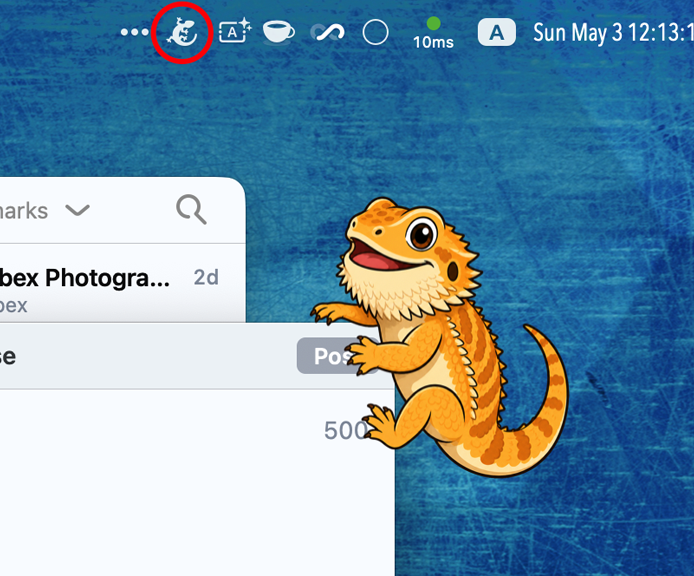
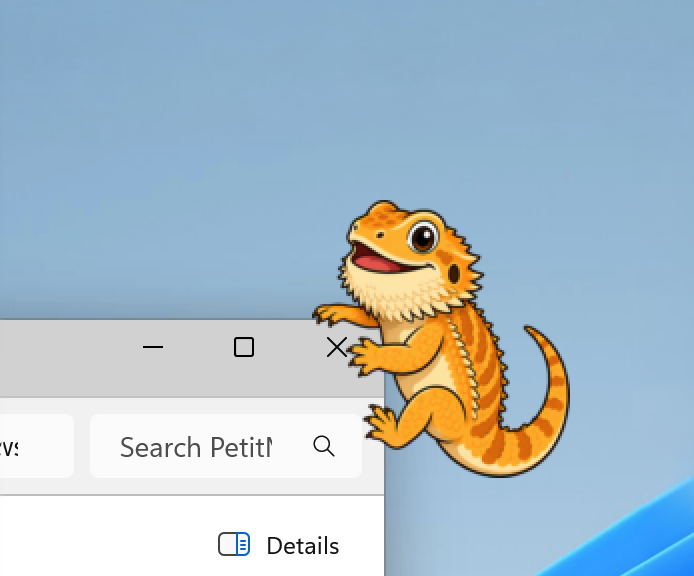
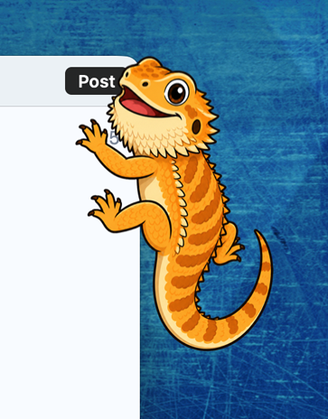
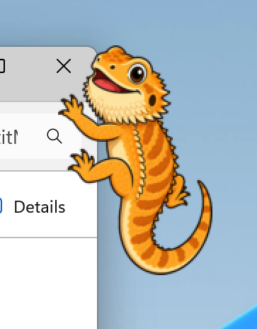
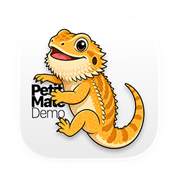
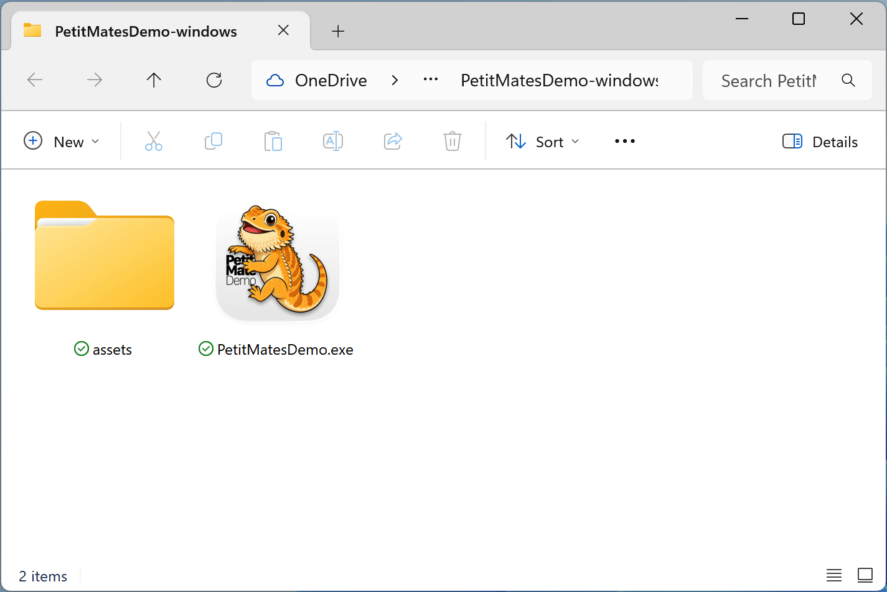

# Petit Mates Demo

A desktop accessory that places a small character on the edges of your windows.
This is a **technology demo**; a bearded dragon clings to your window frames and hangs out on screen.

**A bearded dragon appears on the top edge**
| macOS                                                        | Windows                                                         |
| ------------------------------------------------------------ | --------------------------------------------------------------- |
|  |  |

**Or... the side edge if the space is limited**
| macOS                                                      | Windows                                                       |
| ---------------------------------------------------------- | ------------------------------------------------------------- |
|  |  |

## What it does

- A bearded dragon character appears on the top edge or side of any open window
- The character tracks window movement and stays anchored to the frame
- Hover over the character to make it semi-transparent, so it does not block content
- Lives in the system tray / menu bar — no Dock icon, no taskbar entry

## Platforms
- macOS 13+ (Apple Silicon / Intel)
- Windows 11 (x86-64) †tested on a Arm64 computer via x86-64 emulation

## Installation

Download the latest release for your platform from the Releases page.

### macOS

1. Download `PetitMatesDemo-vX.X.X-darwin-universal.zip`
2. Unzip and move `PetitMatesDemo.app` to `/Applications`
3. Launch the app. A menu bar icon appears
4. To quit, click the menu bar icon and choose **Exit**

> **Note:** On first launch macOS may show a Gatekeeper warning.
> Open **System Settings → Privacy & Security** and click **Open Anyway**.

### Windows 11

1. Download `PetitMatesDemo-vX.X.X-windows-x86_64.zip`
2. Unzip and move `PetitMatesDemo.exe` and `assets` folder to a desired location
3. Launch the app. A tray icon appears in the taskbar notification area
4. To quit, right-click the tray icon and choose **Exit**

> **Note:** `assets` directory must be in the same folder as the executable.

## License

MIT © 2026 Rino, eMotionGraphics Inc.

---

# Petit Mates Demo (Japanese)

ウィンドウの縁にキャラクターを置くデスクトップアクセサリーです。
フトアゴヒゲトカゲがウィンドウ枠にしがみついて画面に常駐します。

**ウィンドウの上端に現れます**
| macOS                                                        | Windows                                                         |
| ------------------------------------------------------------ | --------------------------------------------------------------- |
|  |  |

**スペースが狭いときは側面に**
| macOS                                                      | Windows                                                       |
| ---------------------------------------------------------- | ------------------------------------------------------------- |
|  |  |

## できること

- フトアゴヒゲトカゲがウィンドウの上端または側面に表示されます
- ウィンドウを移動・リサイズしても追従します
- キャラクターにカーソルを重ねると半透明になり、コンテンツの邪魔になりません
- システムトレイ / メニューバーに常駐します。Dock やタスクバーには表示されません

## 対応OS
- macOS 13+（Apple Silicon / Intel）
- Windows 11（x86-64）†Arm64 PC での x86-64 エミュレーション環境でも動作確認済み

## インストール

[Releases](../../releases) ページから、お使いの OS 用の最新版をダウンロードしてください。

### macOS

1. `PetitMatesDemo-vX.X.X-darwin-universal.zip` をダウンロード
2. 解凍して `PetitMatesDemo.app` を `/Applications` に移動
3. アプリを起動するとメニューバーにアイコンが表示されます
4. 終了するにはメニューバーアイコンをクリックして **Exit** を選択

> **注意:** 初回起動時に Gatekeeper の警告が表示される場合があります。
> **システム設定 → プライバシーとセキュリティ** から **このまま開く** をクリックしてください。

### Windows 11

1. `PetitMatesDemo-vX.X.X-windows-x86_64.zip` をダウンロード
2. 解凍して `PetitMatesDemo.exe` と `assets` フォルダを任意の場所に移動
3. アプリを起動するとタスクバーの通知領域にアイコンが表示されます
4. 終了するにはトレイアイコンを右クリックして **Exit** を選択

> **注意:** `assets` フォルダは実行ファイルと同じ場所に置く必要があります。

## ライセンス

MIT © 2026 Rino, eMotionGraphics Inc.
